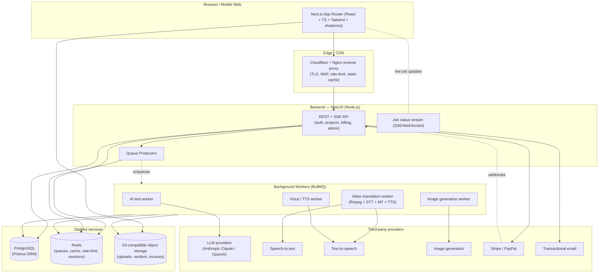
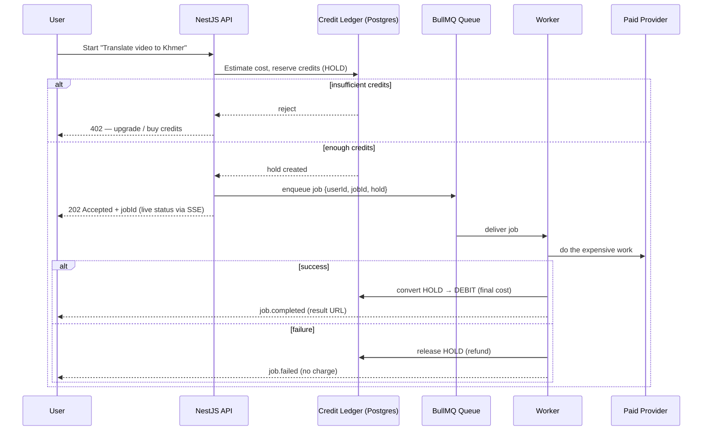
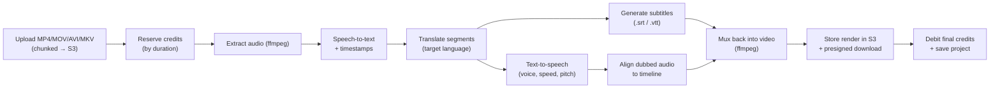
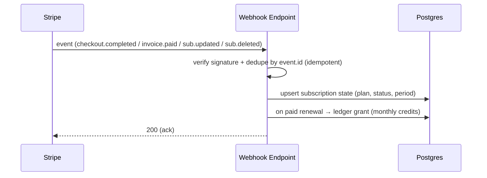

# AI Creator Hub — System Architecture (Phase 1)

> This document is the source of truth for **why** the platform is built the way
> it is. Every subsequent phase (folder structure, database, auth, dashboard, AI
> services, payments, admin, deployment, testing) must trace back to a decision
> recorded here. If a later decision contradicts this document, this document
> gets updated in the same change — the architecture is never allowed to silently
> drift from the code.

---

## 1. Product in one sentence

AI Creator Hub is a subscription SaaS ($0 / $20 / $49 / $99 per month) that lets
creators, marketers, and agencies produce content with AI — the flagship
capability being **video translation** (upload a video → get it dubbed and
subtitled in another language), surrounded by a suite of text/voice generators
(scripts, blogs, captions, titles, hashtags, voiceovers, images).

The business only works if two things are true:

1. **The product feels premium and fast** — comparable to ChatGPT / Linear /
   Notion. Latency and polish are features, not nice-to-haves.
2. **Every expensive operation is metered.** AI inference, transcription,
   translation, TTS, and video encoding cost real money per request. The credit
   system is therefore not an afterthought — it is a first-class domain concept
   that sits between the user and every AI call.

Both of those constraints shape the architecture below.

---

## 2. Architectural principles (the rules we do not break)

| #   | Principle                                                        | Consequence in this codebase                                                                                                                                                            |
| --- | ---------------------------------------------------------------- | --------------------------------------------------------------------------------------------------------------------------------------------------------------------------------------- |
| 1   | **Money-spending work is asynchronous.**                         | Anything that costs credits or takes >1s runs as a background **job**, never inline in an HTTP request. Video translation can take minutes; the API must never block on it.             |
| 2   | **Credits are debited before work starts, refunded on failure.** | A job cannot begin until credits are reserved. This prevents users from spending money we can't bill and prevents us from doing work we can't charge for.                               |
| 3   | **The backend is the only thing that talks to paid APIs.**       | No AI/Stripe/S3 secret ever reaches the browser. The frontend calls _our_ API; our API calls OpenAI/Anthropic/ElevenLabs/Stripe/S3.                                                     |
| 4   | **Multi-tenant isolation is enforced at the data layer.**        | Every domain row carries a `userId` (and, for teams, an `organizationId`). Every query is scoped by the authenticated principal. There is no "trust the frontend to send the right ID." |
| 5   | **Idempotency everywhere it matters.**                           | Webhooks (Stripe), job processing, and file uploads are idempotent so retries never double-charge or double-process.                                                                    |
| 6   | **Fail closed on auth and billing, fail open on cosmetics.**     | If we can't verify a subscription, deny the paid feature. If we can't load a usage graph, show the dashboard anyway.                                                                    |
| 7   | **Everything expensive is observable.**                          | Every AI job writes a row (provider, tokens/seconds, cost estimate, latency) so we can see margins per feature and per plan.                                                            |

---

## 3. High-level system diagram



---

## 4. Why this stack (decisions, not just choices)

The tech stack was specified in the brief. Here is _why_ each piece earns its
place and how the pieces are wired — this is the part that matters for building.

### 4.1 Frontend — Next.js (App Router) + React + TypeScript + Tailwind + shadcn/ui

- **Next.js App Router** gives us Server Components for fast first paint on
  marketing + dashboard shells, and Route Handlers for lightweight
  browser-facing endpoints (auth callbacks, upload signing) without shipping
  secrets to the client.
- **shadcn/ui** (Radix + Tailwind) is chosen over a heavier component kit
  because we _own_ the component source — critical for a "world-class,
  Linear-like" UI where we need to control every pixel, animation, and dark/light
  token. No fighting a design system we can't change.
- **TypeScript end to end.** The API contract is shared as types so the frontend
  and backend can't drift.
- The frontend is a **pure consumer of our API**. It never holds an AI key, a
  Stripe secret, or a DB connection. This keeps the trust boundary clean.

### 4.2 Backend — NestJS (Node.js)

- NestJS gives us **modules, dependency injection, guards, interceptors, and
  pipes** out of the box — which maps almost 1:1 onto our principles: guards for
  auth/roles, interceptors for audit logging, pipes for input validation.
- Node shares the language with the frontend, so **DTOs and validation schemas
  (Zod)** can be shared, and the team context-switches less.
- The backend is split into feature **modules** (auth, users, billing, projects,
  ai, video, admin, credits, notifications) so each concern is independently
  testable and ownable.

### 4.3 Data — PostgreSQL + Prisma

- **PostgreSQL** because our data is relational and money is involved: users →
  subscriptions → invoices → credit ledger must be consistent. We want
  transactions, foreign keys, and `SELECT ... FOR UPDATE` for the credit ledger.
- **Prisma** for type-safe queries and migrations. The schema (Phase 3) is the
  contract; migrations are versioned and run in CI/CD.
- **The credit ledger is append-only.** We never mutate a balance in place; we
  insert ledger entries (`+grant`, `-debit`, `+refund`) and derive the balance.
  This gives us a perfect audit trail and makes disputes/refunds trivial to
  reason about.

### 4.4 Async — Redis + BullMQ

- Every costly operation becomes a **job** on a BullMQ queue backed by Redis.
- Jobs carry a `userId`, the reserved `creditHold`, and an `idempotencyKey`.
- Workers are **separate processes** from the API so a flood of video encodes
  can't starve the API of event-loop time, and we can scale workers
  independently (this is the whole point of the queue).
- Redis also serves **rate limiting**, **response caching**, and **short-lived
  session/refresh-token state**.

### 4.5 Storage — S3-compatible object storage

- User uploads (videos up to several GB), rendered outputs, generated audio,
  images, and PDF invoices live in **S3**, never in Postgres or on the app
  server's disk.
- Uploads use **presigned URLs / multipart chunked upload** so large files go
  browser→S3 directly, bypassing our API for the heavy bytes.
- Access to private objects is always through **short-lived presigned GET URLs**
  scoped to the owning user.

### 4.6 Auth — Auth.js (with a path to Better Auth)

- Email/password, Google, and GitHub OAuth, email verification, password reset,
  and 2FA (TOTP). Sessions use **secure, http-only, same-site cookies**; the API
  authenticates requests via a signed session/JWT.
- Rationale in Phase 4. The key architectural point now: **auth issues a
  principal `{ userId, role, plan }` that every downstream guard trusts**, and
  nothing else is trusted from the client.

### 4.7 Payments — Stripe (primary) + PayPal (secondary)

- Stripe is the **system of record for billing**; our DB mirrors subscription
  state via **webhooks** (source of truth = Stripe events, applied idempotently).
- Plans map to **credit grants**: subscribing/renewing on a plan grants that
  plan's monthly credits via a ledger entry. Downgrades/cancellations adjust
  future grants, never claw back already-spent work.

---

## 5. The three critical flows (these define the system)

### 5.1 Credit lifecycle — the spine of the product



**Why it's built this way:** the user is never charged for work that didn't
finish, and we never start work we can't bill. The hold→debit/refund pattern is
the same one payment processors use, applied to our internal credit currency.

### 5.2 Video translation pipeline — the flagship feature



Each stage is a **checkpoint**: the job persists progress so a worker crash
resumes rather than restarts, and the user sees a real progress bar (extract →
transcribe → translate → voice → merge) instead of a spinner. Cost is a function
of **video duration**, computed up front for the credit hold.

### 5.3 Stripe webhook → subscription + credits



Stripe is the truth; our DB is a **projection** of Stripe events. Replays are
safe because every event is deduped by its Stripe event id.

---

## 6. Security architecture (summary — full detail in later phases)

- **Transport:** TLS everywhere; HSTS at the edge.
- **AuthN/AuthZ:** http-only same-site secure cookies; RBAC via NestJS guards
  (`user`, `admin`, `superadmin`); optional TOTP 2FA.
- **Input:** every request body validated by Zod DTOs; Prisma parameterizes all
  SQL (no string-built queries) → SQL-injection safe by construction.
- **XSS/CSRF:** React escapes by default; CSP headers; CSRF tokens on
  cookie-authed state-changing routes.
- **Rate limiting:** per-IP and per-user token buckets in Redis; stricter limits
  on auth and AI endpoints.
- **Secrets:** only ever in the backend/worker environment; never in the client
  bundle; never committed (`.env` is git-ignored, `.env.example` documents keys).
- **Audit:** admin actions and billing/credit changes append to an audit log.
- **Least privilege:** S3 keys, DB users, and provider keys are scoped as
  narrowly as the provider allows.

---

## 7. Performance & scale posture

- **Stateless API + stateless workers** → scale horizontally behind the load
  balancer; all shared state is in Postgres/Redis/S3.
- **Heavy bytes bypass the API** (browser↔S3 direct via presigned URLs).
- **Caching:** Redis for hot reads (plan config, feature flags, usage
  aggregates); CDN for static assets and marketing pages.
- **Streaming:** AI text results stream to the client (SSE) so users see tokens
  immediately — the ChatGPT feel.
- **Lazy loading & code-splitting** on the frontend so the dashboard shell is
  tiny and features load on demand.
- **Backpressure:** queue concurrency is bounded per worker type so a spike in
  video jobs degrades gracefully (longer queue) instead of melting providers.

---

## 8. Monorepo shape (previewing Phase 2)

A single repository with clearly separated deployables, so shared types and
config live in one place but frontend, backend, and workers ship independently:

```
ai-creator-hub/
├── apps/
│   ├── web/        # Next.js frontend (marketing + app + admin UI)
│   ├── api/        # NestJS REST/SSE API + queue producers
│   └── worker/     # BullMQ consumers (AI, video, voice, image)
├── packages/
│   ├── db/         # Prisma schema, migrations, generated client
│   ├── shared/     # shared TS types, Zod schemas, plan/credit config
│   └── ui/         # shared React components / design tokens (optional split)
├── infra/          # Docker, docker-compose, nginx, CI/CD, deploy configs
└── docs/           # architecture, ADRs, runbooks (this file lives here)
```

Full folder structure, tooling (pnpm workspaces / Turborepo), and the reasoning
for each boundary is **Phase 2**.

---

## 9. Plan & credit model (business logic the architecture must support)

| Plan     | Price  | Monthly credits (illustrative) | Key gates                                                        |
| -------- | ------ | ------------------------------ | ---------------------------------------------------------------- |
| Free     | $0     | Small starter grant            | Watermark on video, limited languages/voices, low concurrency    |
| Pro      | $20/mo | Generous individual grant      | All languages, premium voices, no watermark                      |
| Business | $49/mo | Large grant                    | Higher concurrency, priority queue, team seats (small)           |
| Agency   | $99/mo | Very large grant               | Highest concurrency, most seats, API access, white-label options |

Exact credit numbers and per-feature costs are configuration (in
`packages/shared`), **not** hard-coded in features — so pricing can be tuned
without a code change. Every feature checks the _cost table_ and the _plan
entitlements_, both of which are data.

---

## 10. What Phase 1 deliberately does NOT decide yet

- Exact Prisma models and indexes → **Phase 3**.
- Concrete auth library wiring and 2FA UX → **Phase 4**.
- Specific AI providers per feature and prompt design → **Phase 6**.
- Stripe product/price IDs and PayPal integration details → **Phase 7**.
- CI/CD pipeline steps and deployment topology → **Phase 9**.
- Test strategy and coverage targets → **Phase 10**.

These are intentionally deferred so each gets the focus it deserves — per your
phased delivery requirement.

---

## 11. Phase roadmap & approval gates

| Phase | Deliverable                         | Status      |
| ----- | ----------------------------------- | ----------- |
| 1     | System architecture (this document) | ✅ Complete |
| 2     | Monorepo folder structure + tooling | ✅ Complete |
| 3     | Database schema (Prisma)            | ✅ Complete |
| 4     | Authentication                      | ✅ Complete |
| 5     | Dashboard                           | ⏳ Next     |
| 6     | AI services                         | —           |
| 7     | Payments                            | —           |
| 8     | Admin                               | —           |
| 9     | Deployment                          | —           |
| 10    | Testing                             | —           |

**Gate:** work does not proceed to Phase 2 until this architecture is approved.
