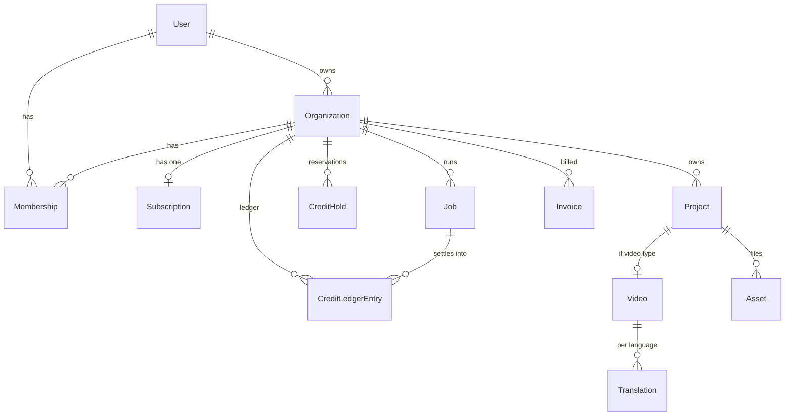

# Database Schema (Phase 3)

The full model lives in [`packages/db/prisma/schema.prisma`](../packages/db/prisma/schema.prisma)
and **validates + generates cleanly** with Prisma 5.20. This document explains
the shape and the decisions that aren't obvious from the schema alone.

## Tenancy: everything hangs off Organization

Every user gets a **personal organization** (`isPersonal = true`) at signup, so
a solo creator never encounters "team" concepts, yet the exact same ownership
model powers Business/Agency teams. Access is always: _user → membership → org
→ data_. There is no user-owned domain data anywhere — one rule, no exceptions.

## The credit system (the part worth reading twice)

Two tables, because reservations and settled history have different lifecycles:

| Table               | Mutability         | Role                                                                                     |
| ------------------- | ------------------ | ---------------------------------------------------------------------------------------- |
| `CreditLedgerEntry` | **Append-only**    | Settled truth: `GRANT`, `DEBIT`, `REFUND`, `ADJUSTMENT`. `amount` is signed.             |
| `CreditHold`        | Status transitions | A reservation while a job runs: `ACTIVE → CAPTURED` (success) or `→ RELEASED` (failure). |

- **Balance** = `SUM(CreditLedgerEntry.amount)` for the org.
- **Available balance** = balance − `SUM(active holds)`.
- Corrections are never edits — they're new `ADJUSTMENT` rows, so the history is
  a perfect audit trail (Architecture §4.3).

This is exactly the hold→capture/release flow from Architecture §5.1, now
expressed in tables. A job links to the `DEBIT`/`REFUND` entry it caused
(`CreditLedgerEntry.jobId`), so every credit movement is traceable to a cause.

## Jobs are the observability backbone

`Job` carries `status`, `progress` (0–100), the video `stage`, the credit
`hold`, and — critically — `providerMeta` (JSON: provider, tokens, seconds,
cost, latency). That last field is what lets the admin panel compute **margin
per feature and per plan** (Architecture §7). `idempotencyKey` is unique so a
retried job never double-processes or double-charges.

## Video pipeline modeling

`Project (VIDEO_TRANSLATE) → Video → Translation[]`. One uploaded video can be
translated into many languages; each `Translation` owns its own subtitle,
dubbed-audio, and rendered-video assets plus the chosen voice. This mirrors the
pipeline in Architecture §5.2 and means re-dubbing into a new language reuses the
existing transcript/source rather than re-uploading.

## Files never live in the database

`Asset` stores only the S3 `s3Key` + metadata (`mimeType`, `sizeBytes`,
`durationSeconds`). Bytes live in object storage and are served via short-lived
presigned URLs (Architecture §4.5). `durationSeconds` is what the credit
estimate reads to size a video job's hold.

## Everything the requirements asked for, mapped

| Requirement entity                     | Model(s)                                          |
| -------------------------------------- | ------------------------------------------------- |
| Users                                  | `User`, `Account`, `Session`, `VerificationToken` |
| Projects                               | `Project`, `Folder`, `Tag`, `ProjectTag`, `Asset` |
| Videos / Translations / Voices         | `Video`, `Translation`, `VoicePreset`             |
| Payments / Subscriptions               | `Subscription`, `Invoice`, `Coupon`               |
| Credits                                | `CreditLedgerEntry`, `CreditHold`                 |
| Logs                                   | `AuditLog`, `ErrorLog`                            |
| Notifications                          | `Notification`                                    |
| API Keys                               | `ApiKey`                                          |
| Referral system                        | `Referral` (+ `User.referralCode`)                |
| Content calendar                       | `CalendarEntry`                                   |
| Admin (announcements, flags, settings) | `Announcement`, `FeatureFlag`, `SystemSetting`    |

## Security & integrity choices

- **Cascade vs. SetNull** is deliberate: deleting an org cascades its data;
  deleting a user who _created_ a project sets `createdById` null (the project
  survives for the org). Nothing important is silently destroyed.
- **Money/credits are integers** (cents, credits) — never floats.
- **Secrets are hashed**: `ApiKey.hashedKey` (plaintext shown once);
  `User.totpSecret` is encrypted at the app layer.
- **Indexes** target the real access patterns: `(orgId, status)`,
  `(orgId, createdAt)`, `(userId, read)`, etc.

## Migrations

The schema is validated; the initial migration (`prisma migrate dev`) is created
against a live database in the deployment/setup step. `pnpm --filter @hub/db seed`
provisions a demo org and demonstrates the grant-as-ledger-entry invariant.
